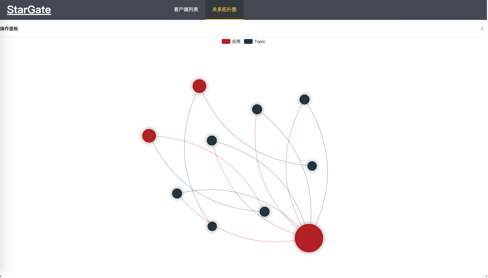

# Stargate

### 简介

Stargate（星门）是一个RocketMQ的客户端，使用全注解的方式，可以很方便的与SpringBoot|Cloud整合，也可以独立使用，你可以在Maven中引入相关依赖

+ Spring Boot|Cloud 引入依赖

```xml
<dependency>
    <groupId>com.yunpian.stargate</groupId>
    <artifactId>yunpian-stargate-springboot</artifactId>
    <version>1.0.0</version>
</dependency>
```

+ 编写生产者

   ```java
   @StargateProducer
   public interface TestProducter {
       @StargateMapper("testaaa")
       SendResult test(@StargateBody HashMap a);
   }
   ```

+ 编写消费者

   ```java
   @StargateConsumer
   public class TestConsumer {
       @StargateMapper("testaaa")
       public void test(@StargateBody HashMap a){
           //TODO
       }
   }
   ```

+ 发送消息

   ```java
   public class Test {
       @Autowired
       private TestProducter testProducter;
       public static void main(String[] args){
           SendResult sendResult = testProducter.test(new HashMap());
       }
   }
   ```
   
+ 详细配置启动消费请参考使用手册
+ [查看使用手册](./manual.md)
   
消费启停
+ 性能测试
  + 发送组件耗时0.7ms（第一次发送200ms）
  + 加上rocketmq连接发送耗时1.6ms
  + 组件消费者耗时1ms

### 项目介绍

+ Stargate作为一个全注解的RocketMQ组件，极大的简化了使用和学习成本，设计上尽肯能的与Spring Cloud注解风格保持一致，并且支持自己开发插件增强功能。主要以简单、易用、易扩展为目的，降低对消息队列的使用成本。

+ Stargate提供6个接口分别用于生产者和消费者扩展注解，扩展rocketClient的处理，扩展消息的处理，通过这些接口用户可以制作自己的插件来实现定制需求。
+ [项目介绍](./introduction.md)
+ [实现原理](https://mp.weixin.qq.com/s/pAXg3eLEfZkqCtgi95SBhQ)

### 使用手册

+ [查看使用手册](./manual.md)

### 扩展手册

+ [查看扩展手册](./yunpian-stargate-sg1/README.md)-->请前往yunpianmvn-stargate-sg1项目

### 更新日志

+ [查看更新日志](./updateLog.md)

### 控制台（Stargate Command）

+ 启动控制台

```xml
<dependency>
  <groupId>com.yunpian.stargate</groupId>
  <artifactId>yunpian-stargate-command</artifactId>
  <version>1.0.0</version>
</dependency>
```

+ 增加注解
```java
@EnableStargateCommand
public class Application {
  public static void main(String[] args) {
    SpringApplication.run(Application.class, args);
  }
}
```

+ 直接启动即可访问控制台

+ 客户端引入同步模块

```xml
<dependency>
  <groupId>com.yunpian.stargate</groupId>
  <artifactId>yunpian-stargate-command</artifactId>
  <version>1.0.0</version>
</dependency>
```

+ 目前控制台支持基本信息展示，消费者启停，消费者线程池控制，关系拓扑图展示

