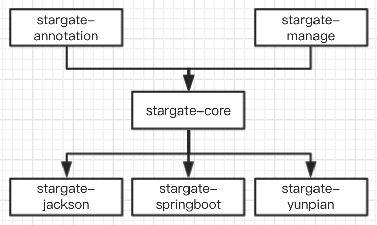
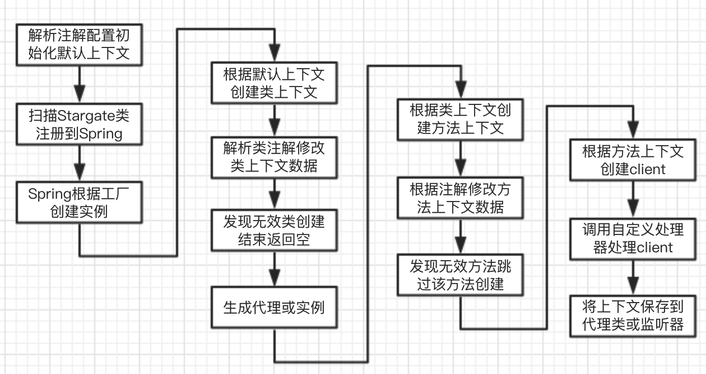
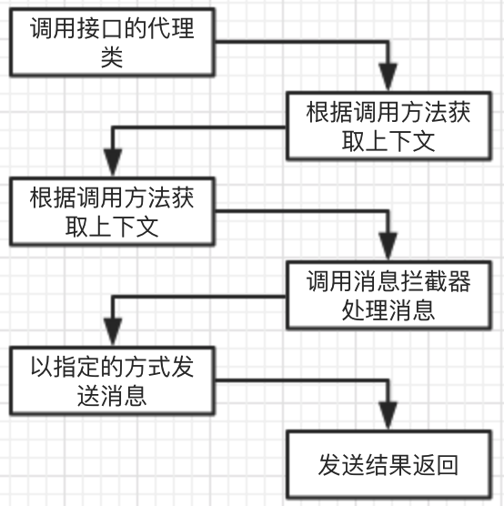
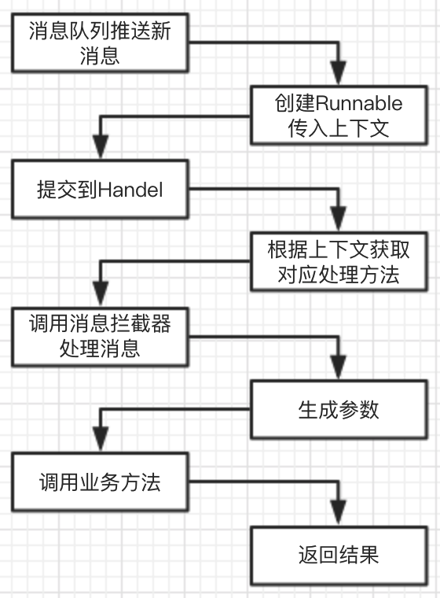

# 项目简介

#### yunpianmvn-stargate-annotation

+ 注解类，注解中使用的枚举类

#### yunpianmvn-stargate-core

+ 核心项目，功能实现

#### yunpianmvn-stargate-manage

+ 管理项目，用于控制消费，服务启停

#### yunpianmvn-stargate-springboot

+ Spring Boot兼容包，用于快速配置

#### yunpianmvn-stargate-jackson

+ Jackson的编解码器实现

#### yunpianmvn-stargate-yunpian

+ 兼容云片basic的编解码器实现

### maven依赖关系

### 功能实现介绍

#### 创建client流程图

#### 发送流程

#### 消费流程

#### 6个接口

- IProcessAnnotationConsume
  - *消费者注解处理器*
- IProcessAnnotationProducer
  - *生产者注解处理器*
- IProcessClientConsume
  - *消费者Client处理器*
- IProcessClientProducer
  - *生产者Client处理器*
- IProcessMessageConsum
  - *消费者Message处理器*
- IProcessMessageProducer	
  - *生产者Message处理器*

#### 上下文

- ConsumeContext
  - *消费者上下文*
- ProducerContext	
  - *生产者上下文*

#### StargateFactory

+ 工厂提供spring创造生产者代理或消费者实例

#### ProcessCenter

+ 各种处理器管理中心

#### ConsumeFactory

+ 消费者工厂

#### MessageListener

+ 消费者监听器

#### ConsumeHandlerImpl

+ 消费者消息执行器

#### ConsumeHandlerRunnable

- 消费者消息处理逻辑

#### ProducerFactory

+ 生产者工厂

#### ProducerInvocationHandlerImpl

+ 生产者代理Handler